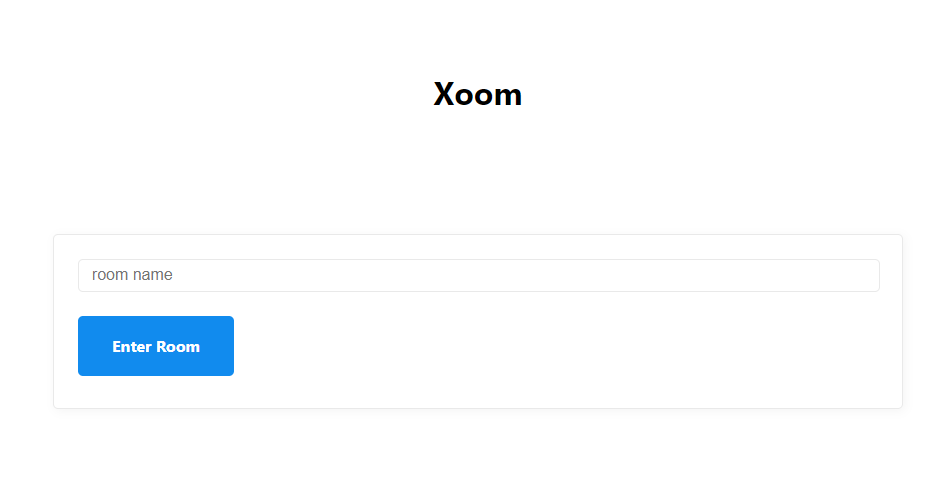

# 📺 P2P Videocall with WebRTC

[노마드 코더의 줌 클론 챌린지](https://nomadcoders.co/noom-challenge) 결과 코드입니다.

> _챌린지 과제 결과이기 때문에 과제 내용 유출 금지를 위해 전체 코드는 공개되어 있지 않습니다._

## 사용 기술
- NodeJS
- WebRTC
- Websockets

## branche 타임라인
1. build-websocket-server
2. using-socketio
3. p2p-videocall-with-webrtc
4. main

<figure>
  </img>
  <figcaption>page preview example</figcaption>
</figure>
