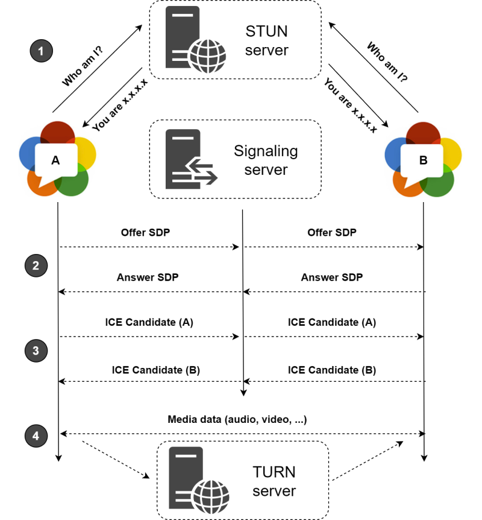

# Lecture Notes

> Core concepts and note explain shortly.   
> `#socket.io` `#websocket` `#WebRTC` `#real-time-chat` `#videocall`

The contents below are in the order of lecture and development.

## 1. Set up the project
### nodemon.json
```js
{
  "ignore": ["src/public/*"],
  "exec": "babel-node src/server.js"
}
```
- The Program as we know watchs the file system and it will restart th server every time something changes.
- "exec": Instead of restarting, Nodemon is going to execute `babel-node` to the `src/server.js` file.

### server.js
```js
import express from 'express'; // [1] import express application

const app = express();

app.set("view engine", "pug"); // [2] set "view engine" to be "pug"
app.set("views", __dirname + "/views")  // [3] set "views" directory
app.use("/public", express.static(__dirname + "/public"));  // [4] set public directory => for Frontend codes
app.get("/", (req, res) => res.render("home"));
app.get("/*", (_, res) => res.redirect("/"));

const handleListen = () => console.log("Listening on http://localhost:3000");
app.listen(3000, handleListen);
```
- If set the public directory like [4], when user go to "/public", user will be able to see the content of the public folder in our project. This means that we can contorl what the user can see.

### mvp.css
```html
<link rel="stylesheet" href="https://unpkg.com/mvp.css">
```

## 2. Build WebSocket Server
### ws server
```js
// server.js
import http from "http";
import WebSocket from "ws";
import express from 'express';

const app = express();

...

const server = http.createServer(app);  // [5] create http server,
const wss = new WebSocket.Server({ server }); // [6] and make web socket server with `server` by http.

...

server.listen(3000, handleListen);  // [7] Then server can listen like this.
```
- To put them together with previous express server on the same port, [5] create make http server with previous express server by `requestListener`. Next, [6] create websocket server and pass `server` to run both server _(http&ws)_. Then we create websocket server on top of http server created using express.js. The http server is exposed by web site and ws on top of that. So we are able to handle both http, ws request on the same port.

### create first connection between the backend and the frontend
```js
// server.js
...
const handleConnection = (socket, request) => {
  console.log(socket) // this socket: represents the browser that just connected
};

wss.on("connection", handleConnection);
...
```
```js
// app.js
const socket = new WebSocket(`ws://${window.location.host}`); // this socket: represents a connection to the server
...
```

### sending and receiving a message to the browser
```js
// server.js
...
// [8] listening the "connection" event, and the callback function pass "socket".
wss.on("connection", (socket) => {
  console.log("Connected to Browser: ✅");

  // [9] listening the "close" event, and when browser closed the callback function run
  socket.on("close", () => console.log("Connected to Browser: ❌"));

  // [10] listening the "message" event, and the callback function pass "message" just recieved
  socket.on("message", (message) => console.log(message));

  // [11] sending message to connected browser
  socket.send("hello!!");
});
...
```
```js
// app.js
...
// [12] listening the "open" evnet, and when server opened the callback function run
socket.addEventListener("open", () => {
  console.log("Connected to Server: ✅");
});

// [13] listening the "message" event, and the callback function pass "message" just recieved
socket.addEventListener("message", (message) => {
  console.log("New Message:", message.data);
});

// [14] listening the "close" event, and when server closed the callback function run
socket.addEventListener("close", () => {
  console.log("Connected to Server: ❌");
});

// [15] sending message to connected server
setTimeout(() => {
  socket.send("hello from the browser!");
}, 10000);
```
- Without "connection" evnet listener [8], browser can listen "open" event of websocket.
- The first argument of [11], must be of type `string` or an `instance of Buffer`, `ArrayBuffer`, or `Array` or an `Array-like Object`.

## 3. Make P2P Videocall room with WebRTC
### WebRTC (https://webrtc.org/)
- [reference post](https://juneyr.dev/webrtc-basics) 
- (WebRTC image)   
</img>


### get camera and audio of user in the room

```js
// app.js
async function getCameras() {
  try {
    const devices = await navigator.mediaDevices.enumerateDevuces();
    const cameras = devices.filter((device) => device.kind === "videoinput");
    ...
  } catch (e) {
    ...
  }
}

async function getMedia(deviceId) {
  ...
  try {
    myStream = await navigator.mediaDevices.getUserMedia(
      deviceId ? cameraConstraint : initialConstraint
    );
    ...
  } catch (e) {
    ...
  }
}
```
- Navigator (window.navigator): https://developer.mozilla.org/ko/docs/Web/API/Navigator
- Navigator.mediaDevices: Return the MediaStream object(The MediaDevices singleton object): https://developer.mozilla.org/ko/docs/Web/API/Navigator/mediaDevices
- MediaDevices.enumerateDevices(): Method to obtain an array of information about the media input and output devices available on the system:  https://developer.mozilla.org/ko/docs/Web/API/MediaDevices/enumerateDevices
- MediaDevices.getUserMedia(): https://developer.mozilla.org/ko/docs/Web/API/MediaDevices/getUserMedia
- And, `MediaDevices.enumerateDevices` method return Promise that resolved with a MediaDeviceInfo array describing the devices. Therefore `getCameras` and `getMedia` functions are async function.

### create RTC connection
- This is 1:1 Communication : Peer A (Caller) & Peer B (Callee)
```js
// app.js
async function initCall() {
  await getMedia();
  makeConnection();
}
...
```
- To create a RTC connection in both Browsers(Peers), when both browsers join the room, the browsers run the `initCall` function. And run the `makeConnection` by that function. 
```js
// app.js
let myStream;
let myPeerConnection;
...
function makeConnection() {
  myPeerConnection = new RTCPeerConnection();
  ...
  myStream
    .getTracks()
    .forEach((track) => myPeerConnection.addTrack(track, myStream));
}
```

### socket events for RTC(Real-Time Communication)
```js
// app.js
socket.on("welcome", async () => {
  // These code run on Peer A(Caller)
  // If someone else joined the room, signaling process will be started.
  ...
  socket.emit("offer", offer, roomName);
  ...
});

socket.on("offer", async (offer) => {
  // These code run on Peer B (Callee)
  // Get the offer from Peer A, and then Peer B set the remote description
  ...
  socket.emit("answer", answer, roomName);
  ...
});

socket.on("answer", (answer) => {
  // Finally, Peer A get the anser from Peer B.
  // Peer A set the remote description.
  myPeerConnection.setRemoteDescription(answer);
});
...
```
```js
// app.js
function makeConnection() {
  ...
  // Got ice candidate and send this,
  myPeerConnection.addEventListener("icecandidate", handleIce);
  // Then we are getting the stream from the another peer.
  // And this peer's stream is painted in the video#peersStream
  myPeerConnection.addEventListener("addstream", handleAddStream);
  ...
}

function handleIce(data) {
  socket.emit("ice", data.candidate, roomName);
}

function handleAddStream(data) {
  const peersStream = document.querySelector("#peerFace video");
  peersStream.srcObject = data.stream;
}
```
```js
// server.js
wsServer.on("connection", (socket) => {
  ...
  socket.on("offer", (offer, roomName) => {
    socket.to(roomName).emit("offer", offer);
  });

  socket.on("answer", (answer, roomName) => {
    socket.to(roomName).emit("answer", answer);
  });

  socket.on("ice", (ice, roomName) => {
    socket.to(roomName).emit("ice", ice);
  });
});
```
- If the browser emit the welcome event when someone enter the room, The Caller **create offer and send this** to The Callee → The Callee **get the offer and create&send answer** → The Caller **get the answer** from the Callee → And **exchange ice(Internet Connectivity Establishment) candidate** → Then exchange the each stream peer to peer
- [WebRTC Native APIs](https://webrtc.github.io/webrtc-org/native-code/native-apis/)  
</img>


## 4. You have to remenber that this is not just the anwser to all the problems!
- If you put more peers, it becomes more heavy.
  - This is the reason why someone use SFU(Selective Forwarding Unit).
- And you can use data channel instead of Socket.io.

### data channel
- RTCPeerConnection.createDataChannel(): https://developer.mozilla.org/ko/docs/Web/API/RTCPeerConnection/createDataChannel